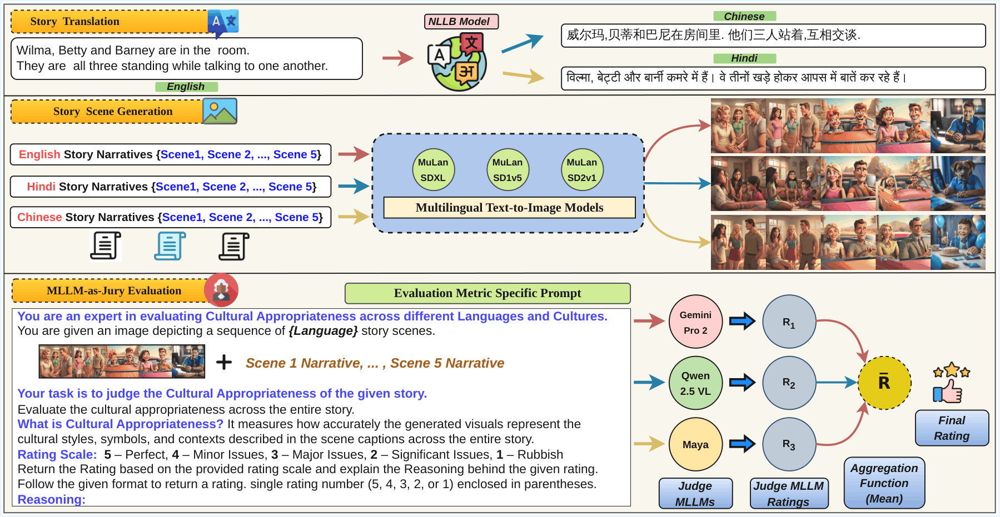

# 🚀 A Progressive Evaluation Framework for Multicultural Analysis of Story Visualization

---

## 📌 Overview

Story visualization models generate sequences of images from textual narratives. Recent advancements in text-to-image generative models have improved narrative consistency in story visualization. However, current story visualization models often overlook cultural dimensions, resulting in visuals that lack cultural fidelity.

This repository introduces a **Progressive Cultural Evaluation Framework** for systematically assessing cultural fidelity in story visualization across multiple languages and datasets. The framework evaluates generated stories using progressively detailed cultural criteria using MLLM-as-Judge.

---

## 🧠 Framework Overview

The proposed framework consists of three major stages:

1. **Story Translation**

   * English → Hindi
   * English → Chinese

2. **Story Visualization**

   * Multilingual text-to-image generation

3. **Progressive Cultural Evaluation**

   * MLLM-as-Jury Culture Evaluation Framework
   
<p align="center">
  
</p>

---

## 🛠️ Project Structure

```text
Cultural_Eval_For_StoryViz/
├── data/
│   ├── vist/
│   └── flintstones/
├── outputs/
│   └── images/
├── scripts/
│   ├── translate_story.py
│   ├── story_visualization.py
│   ├── culture_evalaution_with_MLLM_as_Judge.py
|   ├── culture_evaluation_with_MLLM_as_Jury.py
├── prompts/
├── framework.png
└── README.md
```
---

## 📂 Datasets

We evaluate our framework on two benchmark story visualization datasets.

### 1. VIST (Visual Storytelling Dataset)

* Real-world stories collected from Flickr albums
* Rich cultural diversity and real-world scenarios

### 2. FlintstonesSV

* Animated story visualization dataset based on *The Flintstones* American sitcom.
* American culture and a simpler repetitive setting

---

## 🌍 Story Translation

English narratives are translated into Hindi and Chinese using the **NLLB-200** multilingual translation model.

### Run Translation

```bash
python scripts/translate_story.py \
    --input Data/VIST/VIST_English_500.json \
    --output Data/VIST/ \
    --languages hi zh \
    --model facebook/nllb-200-distilled-600M
```
---

## 🎨 Story Visualization

Images are generated independently for each story scene using multilingual text-to-image models.

### Models Used for Story Visualization

* MuLan-SD1.5
* MuLan-SD2.1
* MuLan-SDXL

### Run Story Visualization

```bash
python Scripts/story_visualization.py \
    --input Data/VIST/VIST_English_500.json \
    --output Images/ \
    --model mulan-sdxl \
    --steps 50 \
    --guidance 7.5
```

> Each scene is generated independently without temporal conditioning because of the lack of multilingual story visualization models.

---

## ⚖️ MLLM-as-Jury Evaluation

Cultural Appropriateness of the story is assessed using multiple multimodal judge models:

* Gemini Pro
* Qwen2.5-VL
* Maya

Each judge produces a score:

```text
r₁, r₂, r₃ ∈ {1,2,3,4,5}
```

The final score is computed with the aggregation function average:

```text
R = (r₁ + r₂ + r₃) / 3
```

Using multiple judges helps reduce individual model bias and improve evaluation robustness.

### Run Individul MLLM-as-Judge Evaluation

```bash
python scripts/evaluate.py \
    --images outputs/images/ \
    --stories data/vist/multilingual.json \
    --level 3 \
    --judges gemini qwen maya \
    --output results/vist_scores.json
```

### Agreegate MLLM-as-Jury Evalaution 

```bash
python scripts/evaluate.py \
    --images outputs/images/ \
    --stories data/vist/multilingual.json \
    --level 3 \
    --judges gemini qwen maya \
    --output results/vist_scores.json
```

---

## 🧾 Evaluation Prompts

The framework uses expert-role prompting to assess cultural appropriateness.

Prompts are given in the folder /Prompts directory.

--

## 📈 Key Findings

* ✅ MuLan-SDXL consistently achieves the highest cultural appropriateness scores.
* ✅ Real-world stories (VIST) generally outperform animated stories (FlintstonesSV).
* ✅ English narratives receive higher scores than Hindi and Chinese translations.
* ✅ More detailed evaluation guidance leads to stricter and more discriminative scoring.
* ⚠️ Generated outputs occasionally contain cultural inconsistencies and stereotypical representations.
* ⚠️ Translation errors can propagate and negatively affect downstream visual generation quality.

---

## 📚 Citation

If you find this work useful, please cite:

```bibtex
@article{kapuriya2025progressive,
  title={A Progressive Evaluation Framework for Multicultural Analysis of Story Visualization},
  author={Kapuriya, Janak and Hatami, Ali and Buitelaar, Paul},
  journal={arXiv preprint arXiv:2511.22576},
  year={2025}
}
```

---

## 🔗 Repository

GitHub Repository:

https://github.com/janak11111/Cultural_Eval_For_StoryViz

---

## 🙌 Acknowledgements

This work was conducted at the **Data Science Institute, University of Galway**.

We thank the open-source communities behind NLLB, MuLan, Gemini, Qwen-VL, and other foundational models that made this research possible.
